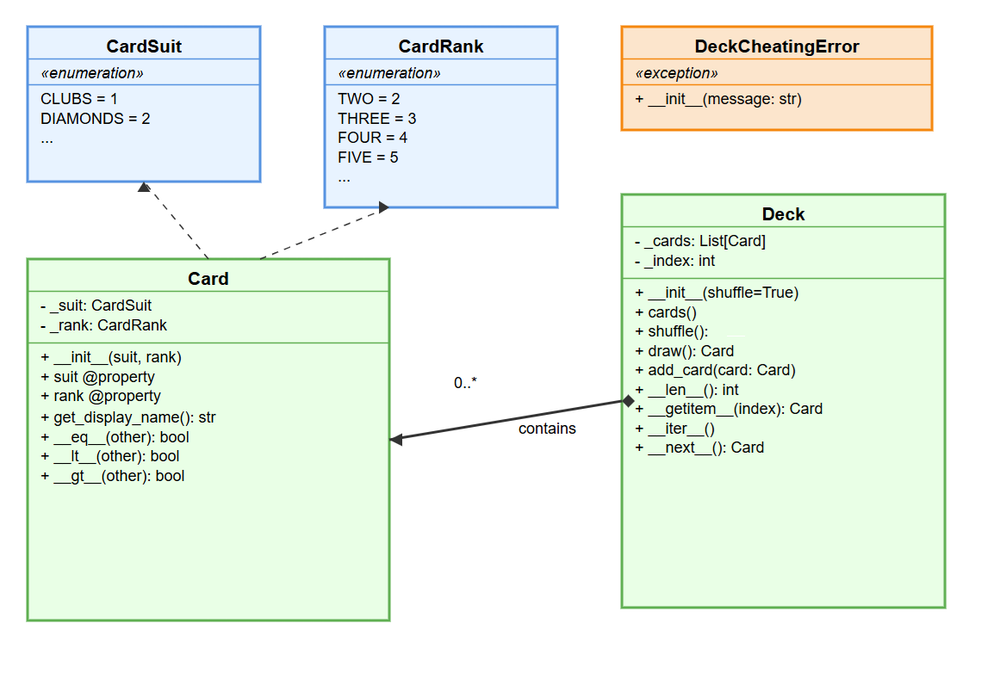

# 🃏 Deck Exercise Instructions

מטרת התרגיל: לממש מערכת המייצגת חפיסת קלפים (`Deck`) וקלפים בודדים (`Card`) בשפת Python עם שימוש באובייקטים, מחלקות, השוואות, ו־iterator



---

## 👑 מחלקת `Card`

### תכונות:
- `_suit`: סוג הקלף (♠️, ♥️, ♦️, ♣️) – אופציונלי להשתמש ב־Enum בשם `CardSuit` (בונוס)
- `_rank`: דרגת הקלף (2 עד Ace) – אופציונלי להשתמש ב־Enum בשם `CardRank` (בונוס)

### מתודות:
```python
def __init__(self, suit, rank)
```
- מאתחלת קלף עם סוג ודרגה

```python
@property
def suit(self)
```
- מחזירה את סוג הקלף

```python
@property
def rank(self)
```
- מחזירה את דרגת הקלף

```python
def get_display_name(self) -> str
```
- מחזירה מחרוזת עם שם הקלף, לדוגמה: `"KING HEART"`

```python
def __eq__(self, other) -> bool
def __lt__(self, other) -> bool
def __gt__(self, other) -> bool
```
- משווים קלפים לפי דרגה או התאמה מדויקת (בהתאם למימוש)

---

## 🎴 מחלקת `Deck`

### תכונות:
- `_cards`: רשימת קלפים
- `_index`: מיקום פנימי עבור מעבר איטרטיבי

### מתודות:
```python
def __init__(self, shuffle=True)
```
- בונה את החבילה, יכול לערבב אם נדרש

```python
def cards(self) -> List[Card]
```
- מחזירה את רשימת הקלפים

```python
def shuffle(self) -> List[Card]
```
- מערבבת את החבילה

```python
def draw(self) -> Card
```
- שולפת קלף מהחבילה  
❗ יש לעטוף ב־decorator שבודק אם יש כפילויות. אם כן – נזרקת החריגה `DeckCheatingError` (בונוס)

```python
def add_card(self, card: Card)
```
- מוסיפה קלף לחבילה

```python
def __len__(self)
def __getitem__(self, index)
def __iter__(self)
def __next__(self)
```
- מאפשרים להשתמש ב־for או list comprehension על Deck

---

## 🧨 חריגה: `DeckCheatingError`

```python
class DeckCheatingError(Exception):
    def __init__(self, message: str)
```
- נזרקת אם מתגלה רמאות (כמו קלף כפול בחבילה)

---

## 💡 בונוסים

1. שימוש ב־`Enum` עבור דרגה וסוג הקלף
2. מימוש decorator שבודק ייחודיות קלפים
3. מימוש תמיכה ב־iterable ו־`for` על Deck

---

## ❓ שאלה מתקדמת: האם אפשר להכניס קלפים למילון (`dict`)?

🔍 רק אם נממש מתודת `__hash__` במחלקת `Card`.  
בנוסף, חובה גם שמימוש `__eq__` יהיה עקבי עם `__hash__`  
כך ש־`card1 == card2` יוביל ל־`hash(card1) == hash(card2)`

```python
def __hash__(self)
```
- נדרש כדי להשתמש ב־Card כמפתח במילון או ב־set

---
